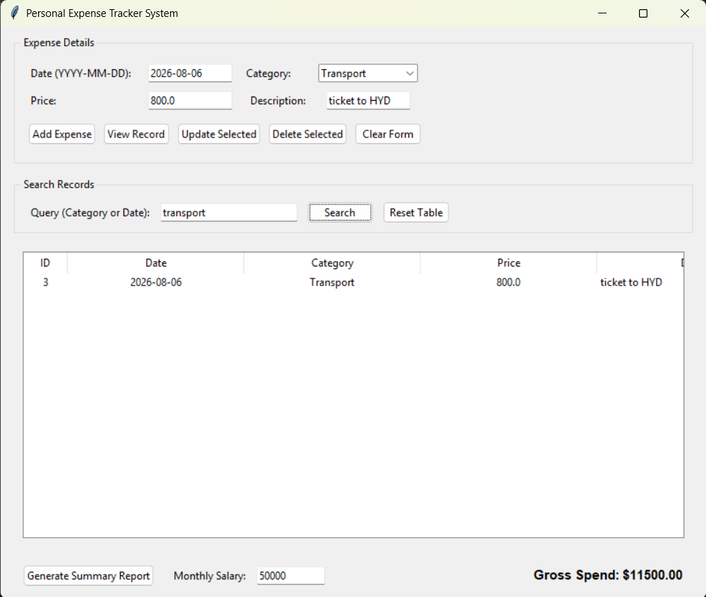

# Personal Expense Tracker:
A desktop GUI application built with Python and Tkinter to track personal income and expenses.
# Application Preview:

## Demo
A short screen recording demonstrating the Personal Expense Tracker GUI and its main features.
[Watch the Demo]()
# Project Overview:
The Personal Expense Tracker allows users to record, manage, search and analyze their daily income and expenses through a simple desktop graphical interface.

Transactions are stored locally using CSV files, making the application lightweight and easy to use without requiring a database.
# Features:
1. Add income and expense transactions.
2. Edit existing transactions.
3. View all transactions.
4. Update transaction details.
5. Delete transactions.
6. Search transactions by date or category.
7. Automatically calculate total spending.
8. View category wise spending summaries.
9. Store transaction data locally using CSV files.
10. Date validation for transactions.
11. User-friendly Tkinter GUI.
# Tech Stack:
Python -- Application development

Tkinter -- Graphical User Interface

CSV -- Local data storage

Jupyter Notebook -- Development and testing
# Project Files:
1. personal_expense_tracker.py - Main Python application.
2. Personal Expense Tracker GUI.ipynb - Jupyter Notebook version.
3. README.md - Project documentation.
4. .gitignore - Git configuration.
# How to Run:
## 1. Install Python
Make sure Python 3.x is installed on your computer.
## 2. Clone the repository
git clone <your-repository-url>
## 3. Open the project folder
cd Personal-Expense-Tracker
## 4. Run the application
python personal_expense_tracker.py

The Personal Expense Tracker GUI will open.
# Data Storage
Transaction data is stored locally using CSV files. No external database is required.
# Project Objective:
The goal of this project is to provide a simple personal finance management application while demonstrating practical Python programming concepts such as:

Object-oriented programming

File handling

CSV data management

Tkinter GUI development

Input validation

Searching and filtering

Data processing and calculations
